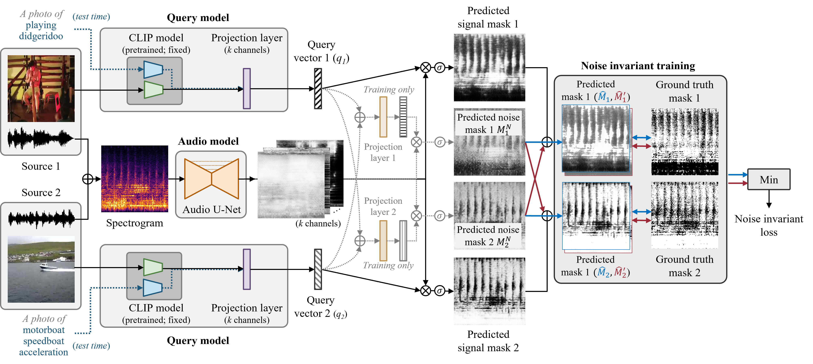

# CLIPSep: Learning Text-queried Sound Separation with Noisy Unlabeled Videos

## CLIPSep - Official PyTorch Implementation

<p align="left"></p>

> **CLIPSep: Learning Text-queried Sound Separation with Noisy Unlabeled Videos**<br>
> [Hao-Wen Dong](https://salu133445.github.io/), [Naoya Takahashi](https://kotonaoya.wixsite.com/naoya-takahashi)*, [Yuki Mitsufuji](https://www.yukimitsufuji.com/), [Julian McAuley](https://cseweb.ucsd.edu/~jmcauley/), [Taylor Berg-Kirkpatrick](https://cseweb.ucsd.edu/~tberg/)<br>
> In ICLR 2023. <span style="font-size: 80%;">(\* corresponding author)</span><br>

> [arXiv](https://arxiv.org/abs/2212.07065) | [OpenReview](https://openreview.net/forum?id=H-T3F0dMbyj) | [Demo](https://sony.github.io/CLIPSep)<br>


## Orgnization

+ [`music`](https://github.com/sony/CLIPSep/tree/main/music): Code for downloading and preprocessing the MUSIC dataset.
+ [`vggsound`](https://github.com/sony/CLIPSep/tree/main/vggsound): Code for downloading and preprocessing the VGGSound dataset.
+ [`clipsep`](https://github.com/sony/CLIPSep/tree/main/clipsep): Code for training and experimenting with the CLIPSep model.


  
## Citation
If you find this work useful for your research, please cite our paper:

```
@inproceedings{dong2023clipsep,
  title={CLIPSep: Learning Text-queried Sound Separation with Noisy Unlabeled Videos},
  author={Hao-Wen Dong and Naoya Takahashi and Yuki Mitsufuji and Julian McAuley and Taylor Berg-Kirkpatrick},
  booktitle={Proceedings of International Conference on Learning Representations (ICLR)},
  year={2023}
}
```
