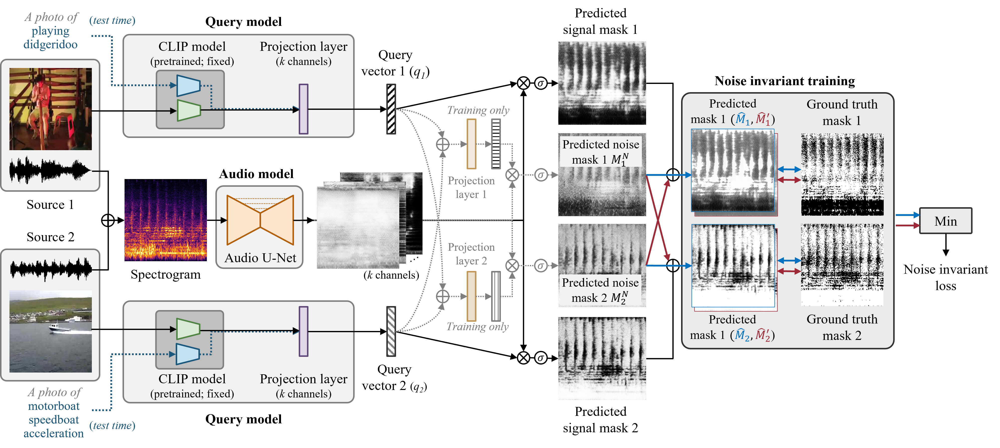

# CLIPSep PyTroch implementation

<p align="left"></p>

## Installation

Clone repository

```bash
 git clone https://github.com/sony/CLIPSep.git
 cd CLIPSep/clipsep
 ``` 

Install the dependencies:
```bash
conda env create -f environment.yml
conda activate clipsep
```

## Datasets and pre-trained model 
We provide a script to download datasets used in our paper and the pre-trained networks. The datasets and network checkpoints will be downloaded and stored in the `CLIPSep/clipsep/data` and `CLIPSep/clipsep/exp/vggsound` directories, respectively.

### MUSIC dataset
Please use the script in `CLIPSep/music` directory.
### VGGSound dataset
Please use the script in `CLIPSep/vggsound` directory.
### Pretrained model

The pretrained CLIPSep-NIT model can be found [here](https://drive.google.com/file/d/1fgwT_wFyNjXxmN45D7jU001Azub0PR54/view?usp=sharing).


## Train
Train CLIPSep-NIT model

```bash
python train.py -o exp/vggsound/clipsep_nit -t data/vggsound/train.csv -v data/vggsound/val.csv --image_model clipsepnit
```

## Inference

```bash
OMP_NUM_THREADS=1 python infer.py -o exp/vggsound/clipsep_nit/  -i "demo/audio/hvCj8Dk0Su4.wav" --text_query "playing bagpipes" -f "exp/vggsound/clipsep_nit/hvCj8Dk0Su4/playing bagpipes.wav"
```

## Evaluate 

Evaluate on MUSIC + VGGSound  

```bash
OMP_NUM_THREADS=1 python evaluate.py -o exp/vggsound/clipsep_nit/ -l exp/vggsound/clipsep_nit/eval_woPIT_MUISC_VGGS.txt -t data/MUSIC/solo/test.csv -t2 data/vggsound/test-good-no-music.csv --no-pit --prompt_ens
```

Evaluate on VGGSoundClean + VGGSound  

```bash
OMP_NUM_THREADS=1 python evaluate.py -o exp/vggsound/clipsep_nit/ -l exp/vggsound/clipsep_nit/eval_woPIT_VGGS_VGGSN.txt -t data/vggsound/test-good.csv -t2 data/vggsound/test-no-music.csv --no-pit --prompt_ens
```

## Visualize
Visualize results on VGGSoundClean + VGGSound  

```bash
OMP_NUM_THREADS=1 python visualize.py -o exp/vggsound/clipsep_nit/ -t data/vggsound/test-good.csv -t2 data/vggsound/test-no-music.csv --vis_dir exp/vggsound/clipsep_nit/visualization_VGGSGood_VGGS
```
    
## Citation
If you find this work useful for your research, please cite our paper:

```
@inproceedings{dong2023clipsep,
  title={CLIPSep: Learning Text-queried Sound Separation with Noisy Unlabeled Videos},
  author={Hao-Wen Dong and Naoya Takahashi and Yuki Mitsufuji and Julian McAuley and Taylor Berg-Kirkpatrick},
  booktitle={Proceedings of International Conference on Learning Representations (ICLR)},
  year={2023}
}
```
