

<a href="https://salu133445.github.io/">Hao-Wen Dong</a>†,
 <a href="https://kotonaoya.wixsite.com/naoya-takahashi/">Naoya Takahashi</a>*,
 <a href="https://www.yukimitsufuji.com/">Yuki Mitsufuji</a>,
 <a href="https://cseweb.ucsd.edu/~jmcauley/"> Julian McAuley</a>,
 <a href="https://cseweb.ucsd.edu/~tberg/"> Taylor Berg-Kirkpatrick</a> 
In International Conference on Learning Representations (ICLR) 2023 
 († Work done during an internship at Sony Group Corporation, * corresponding author) 
<a href="https://arxiv.org/abs/2212.07065">paper</a> | <a href="https://github.com/sony/CLIPSep">code</a>|

## Content

- [Example results on “MUSIC + VGGSound”](#music-vggsound)
  1. ["accordion" + "engine accelerating"](#music-vggsound-1)
  2. ["acoustic guitar" + "cheetah chirrup"](#music-vggsound-2)
  3. ["violin" + "people sobbing"](#music-vggsound-3)
- [Example results on "VGGSound-Clean + VGGSound”](#vggsound-vggsound)
  1. ["cat growling" + "railroad car"](#vggsound-vggsound-1)
  2. ["electric grinder" + "car horn"](#vggsound-vggsound-2)
  3. ["playing harpsichord" + "people coughing"](#vggsound-vggsound-2)
- [Example results on “VGGSound + None”](#vggsound)
  1. ["playing bagpipes"](#vggsound-1)
  2. ["subway, metro, underground"](#vggsound-2)
  3. ["playing theremin"](#vggsound-3)
- [Real-world movie example](#movie)
  1. [Spiderman -- No Way Home (2021)](#movie-1)
- [Robustness to different queries](#queries)
  1. ["acoustic guitar" + "cheetah chirrup"](#queries-1)

---

## Summary of the compared models

- __CLIPSep__: Our proposed model _without_ the noise invariant training.
- __CLIPSep-NIT__: Our proposed model with the noise invariant training using γ = 0.25.
- __LabelSep__: The proposed CLIPSep model with the query model replaced by a learnable embedding lookup table.
- __PIT__: The permutation invariant training model proposed by Yu et al. (2017).[^yu2017]

| Model | Unlabelled data | Post-processing free | Query type (training) | Query type (test) |
|-|:-:|:-:|:-:|:-:|
| CLIPSep | ✓ | ✓ | Image | Text |
| CLIPSep-NIT | ✓ | ✓ | Image | Text |
| LabelSep | ✕ | ✓ | Label | Label |
| PIT | ✓ | ✕ | - | - |
{:style="width: 75%; margin-left: auto; margin-right: auto;"}

[^yu2017]: Dong Yu, Morten Kolbæk, Zheng-Hua Tan, and Jesper Jensen. Permutation invariant training of deep models for speaker-independent multi-talker speech separation. In _Proc. ICASSP_, 2017.

---

## Important notes

- All the examples presented below use _text queries_{:.red} rather than image queries.
- We prefix the text query into the form of "_a photo of [user input query]_".
- All the spectrograms are shown in the log frequency scale.

---

## Example results on "MUSIC + VGGSound" {#music-vggsound}

> __Settings__: We take an audio sample in the MUSIC dataset as the _target source_. We then mix the target source with an _interference_ audio sample in the VGGSound dataset to create an artificial mixture.

### Example 1 -- "accordion" + "engine accelerating" {#music-vggsound-1}

- __Target source__: accordion
- __Interference__: engine accelerating revving vroom
- __Query__: "_accordion_{:.red}"

| Mixture | Ground truth | Ground truth (Interference) | Prediction (CLIPSep) |
|:-:|:-:|:-:|:-:|
| 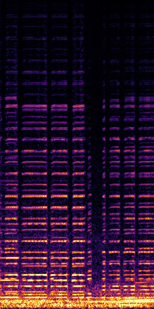{:.spec} | 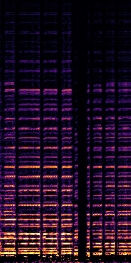{:.spec} | 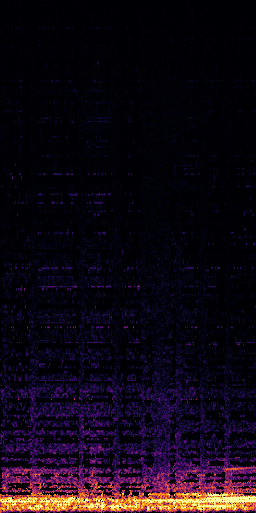{:.spec} | 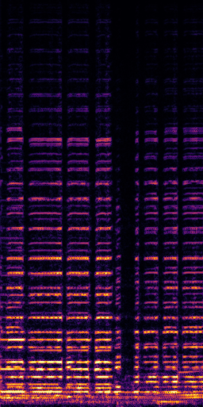{:.spec} |
|  |  |  |  |

| Prediction (CLIPSep-NIT) | Prediction (PIT) | Noise head 1 (CLIPSep-NIT) _\*_{:.red} | Noise head 2 (CLIPSep-NIT) _\*_{:.red} |
|:-:|:-:|:-:|:-:|
| 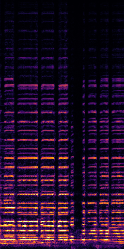{:.spec} | 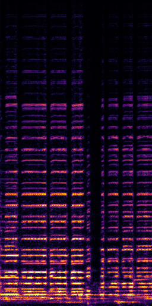{:.spec} | {:.spec} | 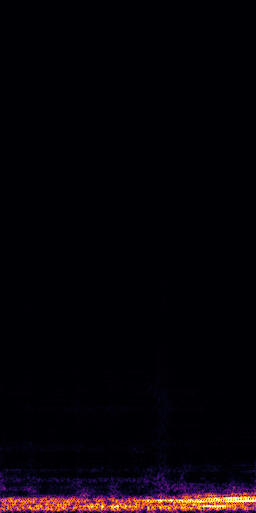{:.spec} |
|  |  |  |  |

> _\*_{:.red} The noise heads are expected to contain query-irrelevant noises.

### Example 2 -- "acoustic guitar" + "cheetah chirrup" {#music-vggsound-2}

- __Target source__: acoustic guitar
- __Interference__: cheetah chirrup
- __Query__: "_acoustic guitar_{:.red}"

| Mixture | Ground truth | Ground truth (Interference) | Prediction (CLIPSep) |
|:-:|:-:|:-:|:-:|
| 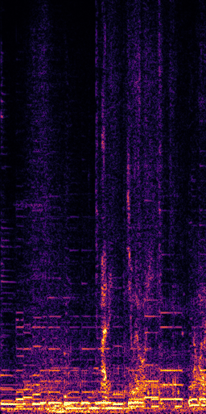{:.spec} | 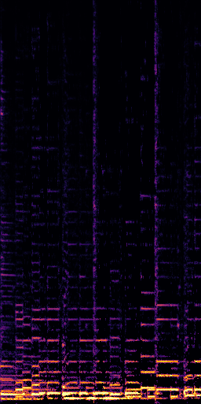{:.spec} | {:.spec} | 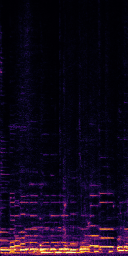{:.spec} |
|  |  |  |  |

| Prediction (CLIPSep-NIT) | Prediction (PIT) _\*_{:.red} | Noise head 1 (CLIPSep-NIT) | Noise head 2 (CLIPSep-NIT) |
|:-:|:-:|:-:|:-:|
| 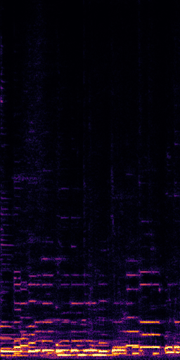{:.spec} | 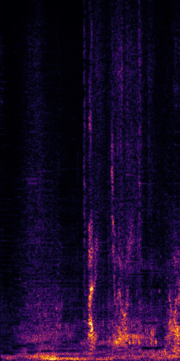{:.spec} | 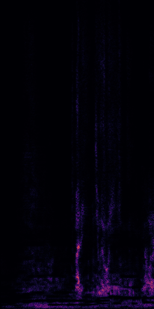{:.spec} | 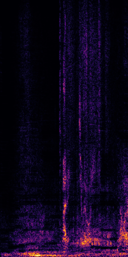{:.spec} |
|  |  |  |  |

> _\*_{:.red} The PIT model requires a post-selection step to get the correct source. Without the post-selection step, the PIT model return the right source in only a 50% chance.

### Example 3 -- "violin" + "people sobbing" {#music-vggsound-3}

- __Target source__: violin
- __Interference__: people sobbing
- __Query__: "_violin_{:.red}"

| Mixture | Ground truth | Ground truth (Interference) | Prediction (CLIPSep) |
|:-:|:-:|:-:|:-:|
| 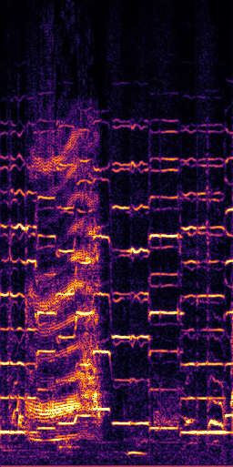{:.spec} | 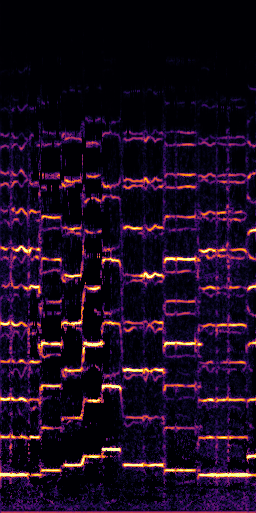{:.spec} | 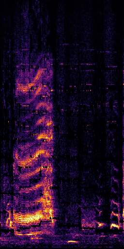{:.spec} | 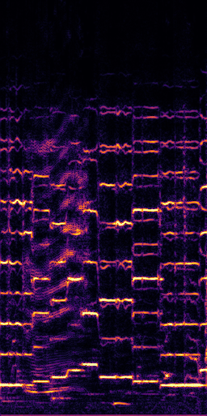{:.spec} |
|  |  |  |  |

| Prediction (CLIPSep-NIT) | Prediction (PIT) | Noise head 1 (CLIPSep-NIT) | Noise head 2 (CLIPSep-NIT) |
|:-:|:-:|:-:|:-:|
| {:.spec} | 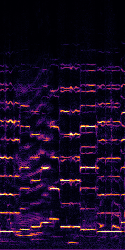{:.spec} | 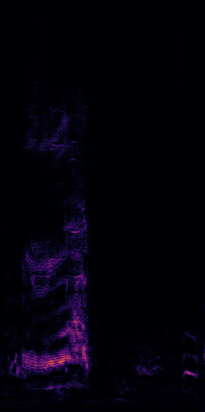{:.spec} | 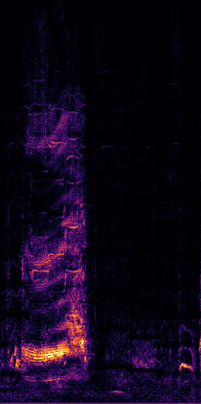{:.spec} |
|  |  |  |  |

---

## Example results on "VGGSound-Clean + VGGSound" {#vggsound-vggsound}

> __Settings__: We take an audio sample in the VGGSound-Clean dataset as the _target source_. We then mix the target source with an _interference_ audio sample in the VGGSound dataset to create an artificial mixture. Note that the LabelSep model does not work on the MUSIC dataset due to the different label taxonomies of the MUSIC and VGGSound datasets.

### Example 1 -- "cat growling" + "railroad car" {#vggsound-vggsound-1}

- __Target source__: cat growling
- __Interference__: railroad car train wagon
- __Query__: "_cat growling_{:.red}"

| Mixture | Ground truth | Ground truth (Interference) |
|:-:|:-:|:-:|
| 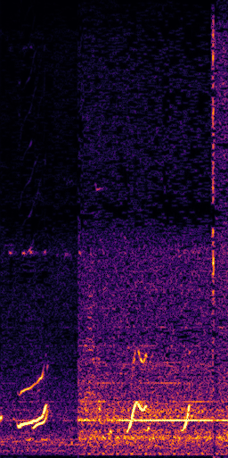{:.spec} | 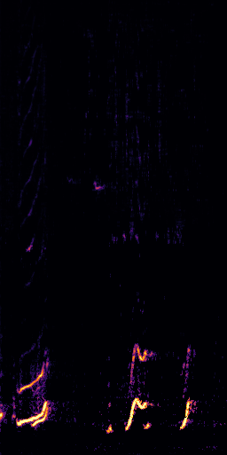{:.spec} | 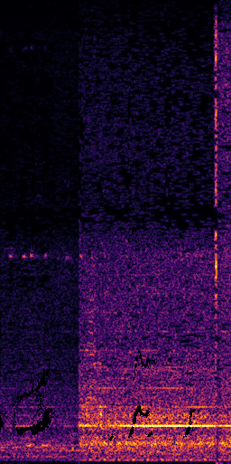{:.spec} |
|  |  | 

| Prediction (CLIPSep) | Prediction (CLIPSep-NIT) | Prediction (PIT) |
|:-:|:-:|:-:|
| 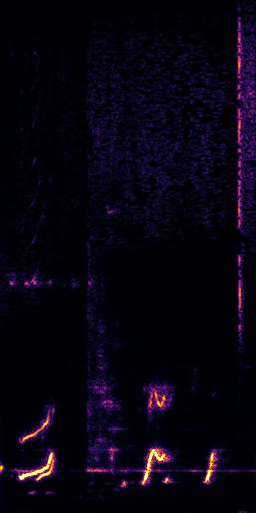{:.spec} | 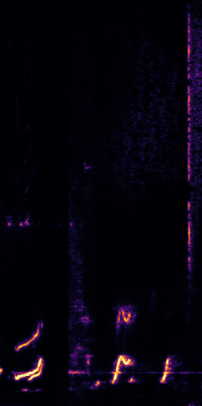{:.spec} | 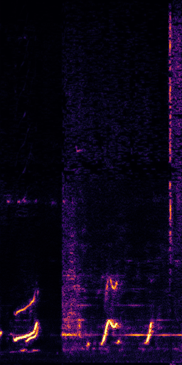{:.spec} |
|  |  |  |

| Prediction (LabelSep) | Noise head 1 (CLIPSep-NIT) _\*_{:.red} | Noise head 2 (CLIPSep-NIT) _\*_{:.red} |
|:-:|:-:|:-:|
| 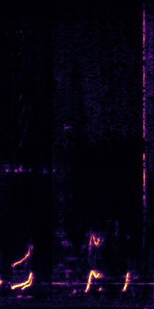{:.spec} | 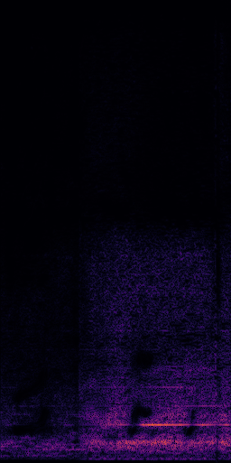{:.spec} | 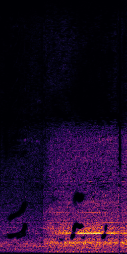{:.spec} |
|  |  |  |

> _\*_{:.red} The noise heads are expected to contain query-irrelevant noises.

### Example 2 -- "electric grinder" + "car horn" {#vggsound-vggsound-2}

- __Target source__: electric grinder grinding
- __Interference__: vehicle horn car horn honking
- __Query__: "_electric grinder grinding_{:.red}"

| Mixture | Ground truth | Ground truth (Interference)
|:-:|:-:|:-:|
| 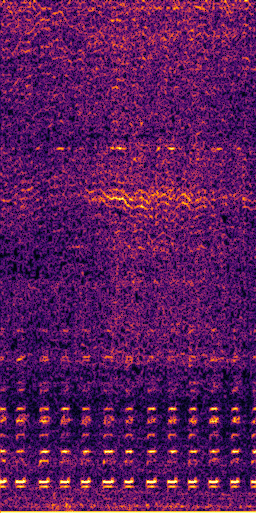{:.spec} | {:.spec} | 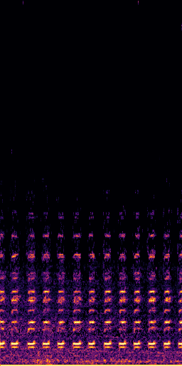{:.spec} |
|  |  | 

| Prediction (CLIPSep) | Prediction (CLIPSep-NIT) | Prediction (PIT) _\*_{:.red} |
|:-:|:-:|:-:|
| 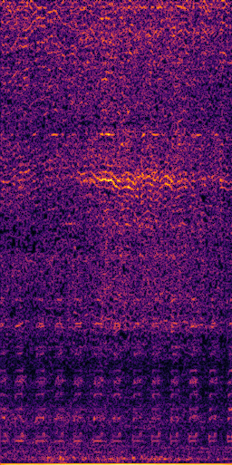{:.spec} | 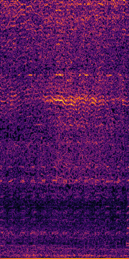{:.spec} | 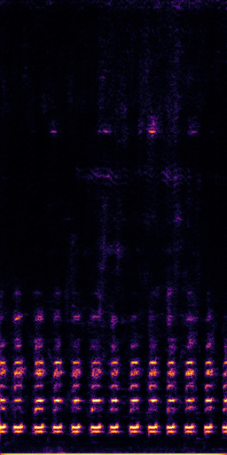{:.spec} |
|  |  |  |

| Prediction (LabelSep) | Noise head 1 (CLIPSep-NIT) | Noise head 2 (CLIPSep-NIT) |
|:-:|:-:|:-:|
| 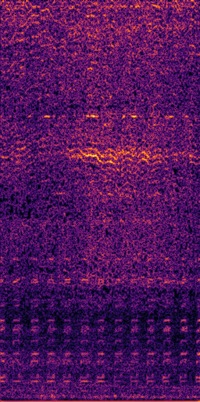{:.spec} | {:.spec} | 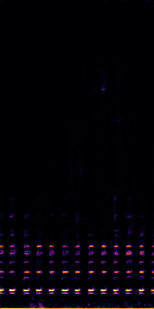{:.spec} |
|  |  |  |

> _\*_{:.red} The PIT model requires a post-selection step to get the correct source. Without the post-selection step, the PIT model return the right source in only a 50% chance.

### Example 3 -- "playing harpsichord" + "people coughing" {#vggsound-vggsound-3}

- __Target source__: playing harpsichord
- __Interference__: people coughing
- __Query__: "_playing harpsichord_{:.red}"

| Mixture | Ground truth | Ground truth (Interference)
|:-:|:-:|:-:|
| 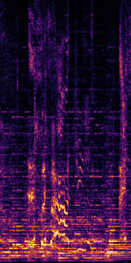{:.spec} | 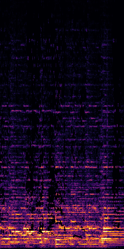{:.spec} | 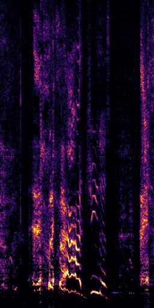{:.spec} |
|  |  | 

| Prediction (CLIPSep) | Prediction (CLIPSep-NIT) | Prediction (PIT) _\*_{:.red} |
|:-:|:-:|:-:|
| 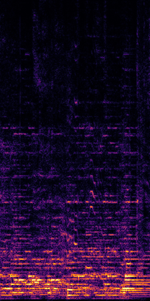{:.spec} | 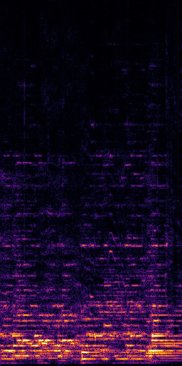{:.spec} | 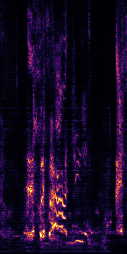{:.spec} |
|  |  |  |

| Prediction (LabelSep) | Noise head 1 (CLIPSep-NIT) | Noise head 2 (CLIPSep-NIT) |
|:-:|:-:|:-:|
| {:.spec} | 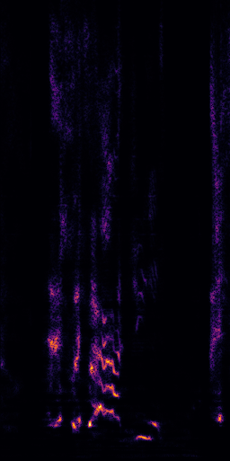{:.spec} | 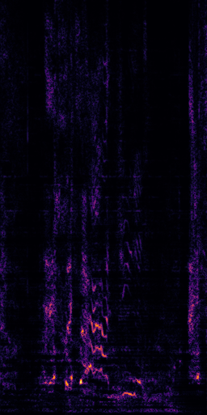{:.spec} |
|  |  |  |

> _\*_{:.red} The PIT model requires a post-selection step to get the correct source. Without the post-selection step, the PIT model return the right source in only a 50% chance.

---

## Example results on "VGGSound + None" {#vggsound}

> __Settings__: We take a "noisy" audio sample in the VGGSound dataset and treat it as the input mixture. We aim to examine if the model can separate the target sounds from query-irrelevant noises. Note that there is no "ground truth" in this setting.

### Example 1 -- "playing bagpipes" {#vggsound-1}

- __Target source__: playing bagpipes ([Bagpipe player in Vegas
](https://www.youtube.com/watch?v=hvCj8Dk0Su4&t=5))
- __Interference__: none
- __Query__: "_playing bagpipes_{:.red}"
- __Note__: The model successfully separates the bagpipe sounds and the background noises.

| Source video |
|:-:|
|  |

| Mixture | Prediction | Noise head 1 | Noise head 2 |
|:-:|:-:|:-:|:-:|
| {:.spec} | 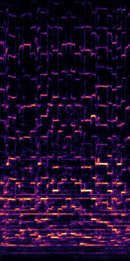{:.spec} | {:.spec} | 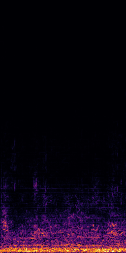{:.spec} |
|  |  |  |  |

### Example 2 -- "subway, metro, underground" {#vggsound-2}

- __Target source__: subway, metro, underground ([Trains At Flitwick Railway Station (03/5/15)](https://www.youtube.com/watch?v=xe7opvK-LJg&t=373s))
- __Interference__: none
- __Query__: "_subway, metro, underground_{:.red}"
- __Note__: The model successfully separates the wind sounds from the train sounds.

| Source video |
|:-:|
|  |

| Mixture | Prediction | Noise head 1 | Noise head 2 |
|:-:|:-:|:-:|:-:|
| 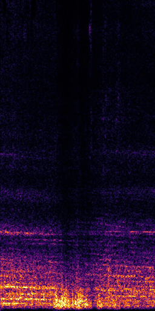{:.spec} | 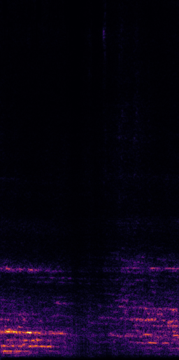{:.spec} | {:.spec} | 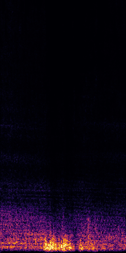{:.spec} |
|  |  |  |  |

### Example 3 -- "playing theremin" {#vggsound-3}

- __Target source__: playing theremin ([Терменвокс](https://www.youtube.com/watch?v=23kti2LQUdw&t=71s))
- __Interference__: none
- __Query__: "_playing theremin_{:.red}"
- __Note__: The model successfully separates most theremin sounds from the piano accompaniments.

| Source video |
|:-:|
|  |

| Mixture | Prediction | Noise head 1 | Noise head 2 |
|:-:|:-:|:-:|:-:|
| {:.spec} | {:.spec} | {:.spec} | {:.spec} |
|  |  |  |  |

---

## Real-world movie example {#movie}

> __Settings__: We take the audio track of a commercial movie clip as the input mixture. We aim to examine if the model can extract the desired sounds corresponding to a specific query. We use the CLIPSep model without the noise invariant training in this demo. Note that we use _text queries_{:.red} rather than image queries.

### "Spiderman -- No Way Home (2021)" {#movie-1}

- __Source__: [Spider-Man: No Way Home (2021) - Curing the Villains Scene (9/10) - Movieclips](https://www.youtube.com/watch?v=A4kZ2Nnsm_g)
- __Note__: While the model is trained on the VGGSound dataset, the model generalizes to commercial movie soundtracks despite the large domain gap.

| Source video |
|:-:|
|  |

| Prediction (Query: "_orchestra_{:.red}") |
|:-:|
|  |

| Prediction (Query: "_people yelling_{:.red}") |
|:-:|
|  |

| Prediction (Query: "_orchestra_{:.red} and _people yelling_{:.red}") |
|:-:|
|  |
| (In the final example, we see how we can _combine __multiple queries__ to extract multiple target sounds_.) |

---

## Robustness to different queries {#queries}

> __Settings__: We take the same input mixture and query the model with different _text queries_{:.red} to examine the model's robustness to different queries. We use the CLIPSep-NIT model in this demo.

### "acoustic guitar" + "cheetah chirrup" {#queries-1}

- __Target source__: acoustic guitar
- __Interference__: cheetah chirrup
- __Note__: We can see that the model is robust to different text queries and can extract the desired sounds.

| Mixture | Ground truth | Ground truth (Interference) |
|:-:|:-:|:-:|
| {:.spec} | {:.spec} | {:.spec} |
|  |  |  |

| Prediction (Query: "_acoustic guitar_{:.red}") | Prediction (Query: "_guitar_{:.red}") | Prediction (Query: "_a man is playing acoustic guitar_{:.red}") |
|:-:|:-:|:-:|
| {:.spec} | {:.spec} | {:.spec} |
|  |  |  |

| Prediction (Query: "_a man is playing acoustic guitar in a room_{:.red}") | Prediction (Query: "_car engine_{:.red}") |
|:-:|:-:|
| {:.spec} | {:.spec} |
|  |  |

---
